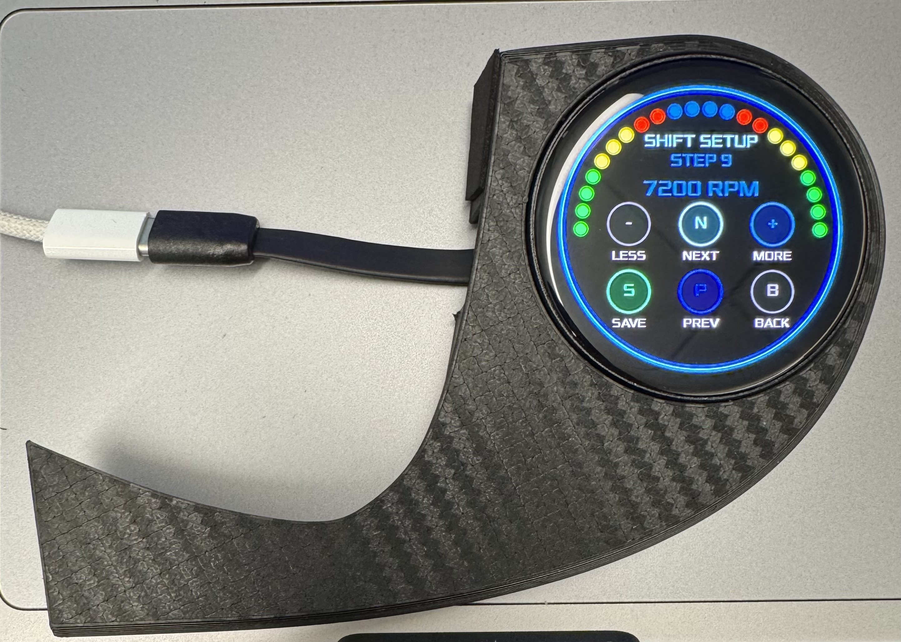

# BlueLine One

BlueLine One is a custom ESP32-S3 round AMOLED CAN bus gauge. It displays live OBD-II vehicle data including RPM, speed, throttle, intake air temperature, coolant temperature, battery voltage, airflow, MPG, TPMS UI, and a chronograph-style display with touch controls.

> **Project status:** Early development / proof of concept. Features, layouts, OBD polling, and vehicle compatibility may change.

---

## Preview





---

## Current Features

### 4-in-1 All-In-One Gauge

The main screen combines:

- RPM shift-light arc
- Vehicle speed
- Throttle position
- Intake air temperature

The RPM shift lights use adjustable activation points and progress through green, yellow, red, and blue.

### Individual Gauge Screens

- RPM
- Speed
- Throttle
- Intake air temperature
- Coolant temperature
- Battery voltage
- TPMS interface
- Airflow / MAF
- Instant and estimated average MPG
- Chronograph with tachymetre-style display

### Interface and Controls

- BLE OBD-II connectivity
- Touch swipe navigation
- Long-press controls
- MPH/KPH switching
- Fahrenheit/Celsius switching
- Adjustable RPM shift-light points
- Multiple ring-light colors
- No-color / ring-off mode
- Adjustable display brightness
- Saved settings using ESP32 Preferences
- PWR button chronograph start/stop
- BOOT button chronograph reset

---

## Gauge Order

The current swipe order is:

```text
4-in-1 / All-In-One
RPM
Speed
Throttle
Intake Air
Coolant
Battery
TPMS
Airflow
MPG
Chronograph
Back to 4-in-1 / All-In-One
```

---

## Hardware

BlueLine One is currently designed around:

- Waveshare ESP32-S3 1.75-inch round AMOLED
- 466 × 466 resolution
- ESP32-S3
- CO5300 display controller
- CST92xx touch controller
- AXP2101 power-management controller
- BLE OBD-II adapter, such as the LELink²
- USB-C power source
- Optional 3D-printed mount or enclosure

---

## Vehicle Compatibility

BlueLine One is currently being developed and tested on a:

```text
2019 Mazda MX-5 Miata ND2
Manual transmission
LELink² BLE OBD-II adapter
```

Standard OBD-II data may work on other vehicles, but compatibility has not been confirmed.

Some vehicle-specific functions, including TPMS and oil temperature, may require manufacturer-specific CAN headers or extended PIDs.

---

## Required Software

- Arduino IDE
- ESP32 board package by Espressif Systems

### Required Arduino Libraries

Install the following libraries using Arduino IDE Library Manager:

- **LVGL**
- **GFX Library for Arduino**
- **SensorLib**
- **XPowersLib**

The project uses the BLE, Wire, Preferences, and Arduino libraries included with the ESP32 board package.

---

## Tested Board Settings

Recommended Arduino IDE settings:

```text
Board: ESP32S3 Dev Module
USB CDC On Boot: Enabled
Flash Size: 16MB
PSRAM: OPI PSRAM
Partition Scheme: Huge APP
Upload Speed: 460800
```

Settings may vary depending on the installed ESP32 board-package version.

---

## Project Structure

```text
Blueline_One/
├── Blueline_One.ino
├── pin_config.h
├── lv_conf.h
├── LICENSE
├── README.md
└── src/
    └── Fonts/
        ├── Xolonium_pn4D12pt7b.c
        ├── Xolonium_pn4D18pt7b.c
        ├── Xolonium_pn4D24pt7b.c
        ├── Xolonium_pn4D32pt7b.c
        ├── Xolonium_pn4D48pt7b.c
        ├── Xolonium_pn4D60pt7b.c
        └── Xolonium_pn4D72pt7b.c
```

The third-party libraries are installed through Arduino Library Manager and are not bundled inside this repository.

---

## Installation

1. Download this repository as a ZIP or clone it with Git.
2. Keep the project folder named `Blueline_One`.
3. Open `Blueline_One.ino` in Arduino IDE.
4. Install the required Arduino libraries.
5. Install the ESP32 board package by Espressif Systems.
6. Select the recommended ESP32-S3 board settings.
7. Connect the display by USB-C.
8. Compile and upload the sketch.

---

## BLE OBD-II Setup

1. Insert the BLE OBD-II adapter into the vehicle.
2. Turn the vehicle ignition on.
3. Start BlueLine One.
4. Long-press the Bluetooth icon.
5. Select **Scan**.
6. Select the OBD-II adapter from the list.
7. Allow BlueLine One to initialize the adapter.

The selected adapter can be saved for future reconnect attempts.

---

## Touch Controls

```text
Swipe left or right: Change gauge screen
Swipe up or down: Change ring-light color
Double tap: Change display brightness
Long-press Bluetooth icon: Open BLE menu
Long-press speed value/unit: Toggle MPH/KPH
Long-press temperature value: Toggle °F/°C
Long-press TPMS unit: Toggle PSI/kPa
Long-press RPM gear icon: Open shift-light settings
Long-press MPG area: Reset estimated average MPG
```

### Chronograph Controls

```text
PWR button: Start/stop
BOOT button: Reset
Screen tap: Reset
```

---

## Ring-Light Options

```text
Cyan
Blue
Red
Yellow
Green
Purple
Magenta
Synthwave
No Color / Ring Off
```

Ring-light settings are stored independently for each gauge screen.

---

## OBD-II Data

BlueLine One currently uses standard OBD-II commands for:

| Data | Command |
|---|---|
| Adapter voltage | `ATRV` |
| Control-module voltage fallback | `0142` |
| RPM | `010C` |
| Speed | `010D` |
| Coolant temperature | `0105` |
| Throttle position | `0111` |
| Intake air temperature | `010F` |
| MAF airflow | `0110` |

TPMS support is experimental and may require Mazda-specific extended diagnostic requests.

---

## MPG Estimation

Instant MPG is estimated from vehicle speed and MAF airflow.

Average MPG is calculated from estimated trip distance and estimated fuel use. It is intended as an experimental display value and should not be treated as a calibrated fuel-economy measurement.

---

## Known Limitations

- TPMS values are currently experimental.
- Oil-temperature support depends on vehicle PID availability.
- MPG values are estimates derived from OBD-II data.
- BLE compatibility may vary by adapter.
- Touch performance may vary with power-supply quality and electrical noise.
- Vehicle-specific CAN data may require additional research.
- This project is still under active development.

---

## Troubleshooting

### XPowersLib not found

Make sure `XPowersLib` is installed and use:

```cpp
#include <XPowersLib.h>
#define BLUELINE_HAS_XPOWERS 1
```

### Font compilation error

The custom font files belong in:

```text
src/Fonts/
```

They should use the standard LVGL include generated by the LVGL font converter.

### Duplicate library definitions

Do not keep duplicate renamed libraries inside the Arduino `libraries` folder. Arduino may still detect and compile them even when the folder name ends with `_DISABLED`.

Move unused copies completely outside:

```text
Documents/Arduino/libraries/
```

Then restart Arduino IDE and clear its build cache if necessary.

---

## Roadmap

Planned or experimental features include:

- Confirmed live TPMS pressure values
- Expanded Mazda-specific CAN data
- Gear detection
- Ethanol-content display
- Additional display layouts
- OTA firmware updates
- Improved average-MPG calculation
- Additional vehicle compatibility
- 3D-printable mounting solutions

---

## Contributing

Bug reports, testing feedback, compatibility reports, and code contributions are welcome.

When reporting an issue, include:

- Vehicle year, make, and model
- OBD-II adapter model
- Arduino IDE version
- ESP32 board-package version
- Library versions
- Full compile or Serial Monitor output
- Photos or video when relevant

---

## Disclaimer

BlueLine One is an experimental DIY automotive display project. Use it at your own risk.

The author is not responsible for:

- Vehicle damage
- Electrical damage
- Incorrect or delayed data
- Installation problems
- Driver distraction
- Traffic violations
- Personal injury
- Property damage
- Misuse of the project

Do not interact with the display while driving. Verify critical vehicle information using appropriate diagnostic equipment.

---

## License

BlueLine One is released under the MIT License.

Third-party libraries, fonts, trademarks, and hardware products remain subject to their respective licenses and ownership.
